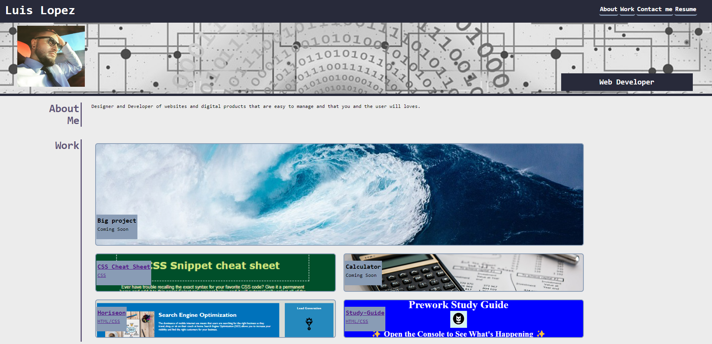

# My-Portfolio

## Description

"My Portfolio" is a showcase of different projects Im building in my journey of learning different coding languages and present my skills while building each one of them.

## Installation

N/A

## Usage

"My Portfolio" can be used to see different variations of coding languages and how they are implemented as they change constantly in my learning journey.

## Credits

N/A

## License

Licensed under the MIT license.

## link

The following image shows the web application's appearance:
[My Portfolio](https://ll8719.github.io/portfolio-deploy/)

## Screenshot

The following link displays the application on the web.

